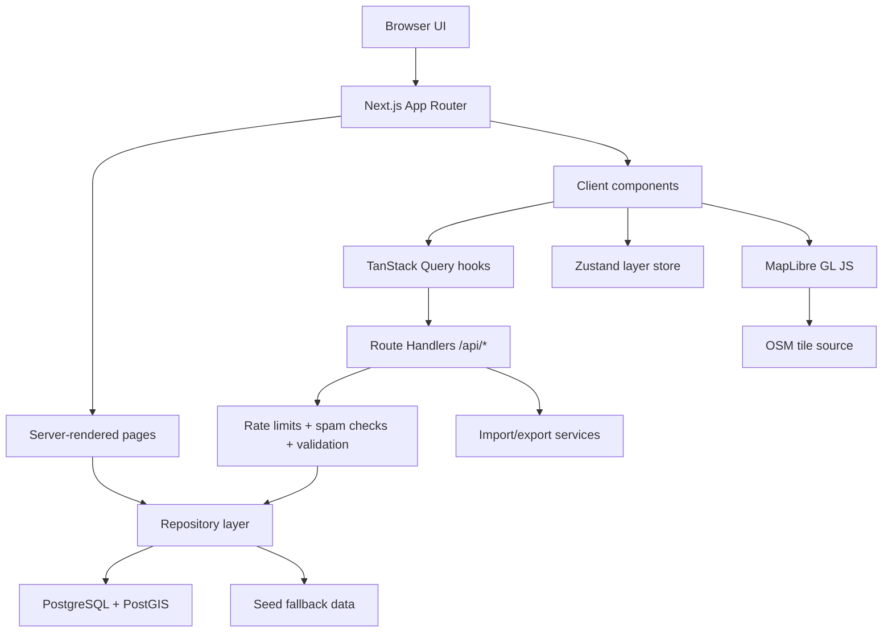
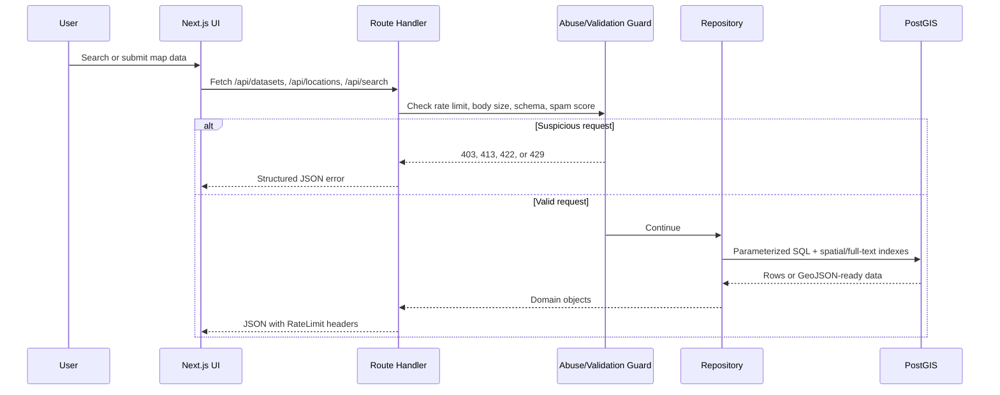
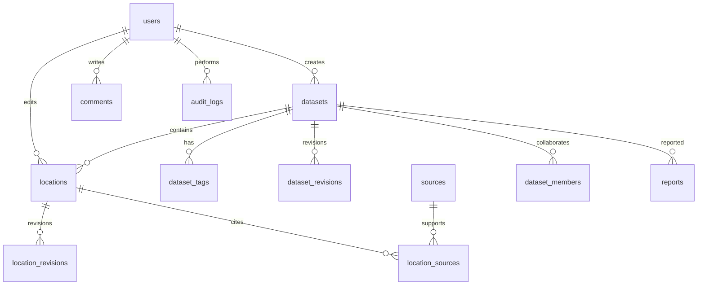

# MapWiki

MapWiki is an open-source collaborative mapping platform for community-generated geographic datasets. It is built as a "Wikipedia of maps": contributors can create datasets, add geographic objects, cite sources, view revision history, overlay multiple layers, import/export data, and explore the world through thematic maps.

The MVP is a production-oriented TypeScript application designed for Vercel, PostgreSQL, and PostGIS. It currently includes a map-first UI, seeded public datasets, import/export tooling, REST APIs, OpenAPI documentation, append-only revisions, moderation primitives, and abuse controls for open submissions.

## Why MapWiki Exists

Most map products answer "where is something?" MapWiki is designed to answer richer questions:

- What happened here?
- What exists here?
- What can I learn from this place?
- Which datasets become interesting when they are overlaid?

Example: enable "Universities", "AI Research Labs", and "Venture Capital Firms" to inspect innovation clusters. Or combine "Renewable Energy Projects" with "Data Centers" to reason about infrastructure pressure and power demand.

## What Is Implemented

- Map-first landing page and interactive explorer.
- Dataset pages with descriptions, statistics, contributors, history, comments, and download options.
- Layer controls for enabling, disabling, coloring, opacity tuning, heatmaps, and stacked overlays.
- Dataset creation wizard.
- Location/object creation for points, lines, and polygons.
- CSV, TSV, GeoJSON, KML, and GPX import preview.
- CSV, GeoJSON, JSON, KML, and GPX export routes.
- Ranked global search across datasets, locations, users, tags, and categories.
- PostgreSQL/PostGIS schema with spatial indexes, full-text search, citations, moderation tables, and revision tables.
- Git-like append-only revision model for datasets and locations.
- Open contribution mode using an anonymous contributor account.
- Abuse controls: rate limits, spam scoring, honeypots, duplicate detection, request-size guards, audit events, hashed IP bans, and safe error responses.
- NextAuth scaffolding for GitHub, Google, and email login if you decide to enable accounts later.
- Vitest unit/integration tests and Playwright e2e coverage.
- Vercel deployment configuration.

## Tech Stack

| Area | Technology |
| --- | --- |
| Language | TypeScript |
| Web framework | Next.js App Router |
| UI | React, TailwindCSS, ShadCN-style local components, Radix primitives, lucide-react |
| Data fetching | TanStack Query |
| Client state | Zustand |
| Mapping | MapLibre GL JS, OpenStreetMap-compatible raster tiles |
| API | Next.js Route Handlers, Server Actions |
| Database | PostgreSQL, PostGIS, pg_trgm, generated tsvector columns |
| Auth scaffold | NextAuth with optional GitHub, Google, and email providers |
| Abuse prevention | Postgres-backed fixed-window limits, spam scoring, hashed IP ban table |
| Imports | csv-parse, fast-xml-parser |
| Testing | Vitest, Testing Library, Playwright |
| Deployment | Vercel, Neon Postgres with PostGIS |

## Architecture



### Request Flow



### Data Model



## Repository Structure

```text
app/                 Next.js pages, layouts, route handlers, providers
components/          Shared UI, navigation, footer, cards, map components
features/            Feature-owned UI and state: search, imports, datasets
hooks/               Client hooks for API-backed data flows
lib/                 Validation, API helpers, OpenAPI, abuse/rate-limit logic
server/              Database repositories, auth helpers, moderation workflows
services/            Import parsers and export serializers
database/            SQL migrations and seed data
docs/                Architecture, API, database, abuse controls, and environment docs
scripts/             Migration, seed, reset, and OpenAPI generation scripts
tests/               Unit, integration, and Playwright e2e tests
types/               Shared domain and framework augmentation types
```

## Local Development

### 1. Install dependencies

```bash
npm install
```

### 2. Configure environment

Create a local environment file using the variables below. For local development, the minimum useful setup is:

```bash
APP_URL=http://localhost:3000
NEXTAUTH_URL=http://localhost:3000
NEXTAUTH_SECRET=replace-with-a-long-random-string
DATABASE_URL=<local Postgres connection URL>
DATABASE_SSL=false
RATE_LIMIT_SALT=replace-with-a-long-random-string
```

OAuth and email variables are optional. If provider credentials are missing, that provider is skipped at runtime.

### 3. Start PostGIS locally

```bash
POSTGRES_PASSWORD=<local-password> docker compose up -d
```

### 4. Run migrations and seed data

```bash
npm run db:migrate
npm run db:seed
```

### 5. Run the app

```bash
npm run dev
```

Open `http://localhost:3000`.

The application also has committed MVP seed fallback data, so many read-only flows still render without `DATABASE_URL`. Mutations, production abuse controls, and durable history require Postgres.

## Useful Commands

```bash
npm run dev          # start Next.js locally
npm run build        # production build
npm run start        # run the built app
npm run typecheck    # TypeScript validation
npm run lint         # ESLint
npm run test         # Vitest unit/integration tests
npm run test:e2e     # Playwright tests
npm run db:migrate   # apply SQL migrations
npm run db:seed      # load sample datasets
npm run db:reset     # reset and reseed local database
npm run openapi      # write docs/openapi.json
```

## Environment Variables

| Variable | Required | Purpose |
| --- | --- | --- |
| `APP_URL` | Production | Canonical public app URL |
| `DATABASE_URL` | Production | PostgreSQL/PostGIS connection string |
| `DATABASE_SSL` | Production-dependent | Set to `true` for managed Postgres SSL |
| `NEXTAUTH_URL` | If auth enabled | Public callback URL |
| `NEXTAUTH_SECRET` | Recommended | Session secret and fallback abuse salt |
| `RATE_LIMIT_SALT` | Production | Salt for hashing IP/client identifiers |
| `GITHUB_ID`, `GITHUB_SECRET` | Optional | GitHub OAuth |
| `GOOGLE_CLIENT_ID`, `GOOGLE_CLIENT_SECRET` | Optional | Google OAuth |
| `EMAIL_SERVER`, `EMAIL_FROM` | Optional | SMTP email login |
| `EMAIL_HTTP_ENDPOINT`, `EMAIL_HTTP_TOKEN` | Optional | HTTP email delivery adapter |
| `BLOB_READ_WRITE_TOKEN` | Optional | Future Vercel Blob media uploads |

See [docs/ENVIRONMENT.md](docs/ENVIRONMENT.md) for details.

## Database

The schema lives in [database/migrations](database/migrations). The initial migration enables PostGIS, trigram search, and UUID support. Later migrations add open-submission abuse controls and hashed IP bans.

The `locations` table stores all geometries in WGS84:

```sql
CREATE TABLE locations (
  id uuid PRIMARY KEY DEFAULT uuid_generate_v4(),
  dataset_id uuid NOT NULL REFERENCES datasets(id) ON DELETE CASCADE,
  title text NOT NULL,
  description text NOT NULL DEFAULT '',
  geometry geometry(Geometry, 4326) NOT NULL,
  geometry_type text NOT NULL CHECK (
    geometry_type IN (
      'Point',
      'LineString',
      'Polygon',
      'MultiPoint',
      'MultiLineString',
      'MultiPolygon'
    )
  ),
  metadata jsonb NOT NULL DEFAULT '{}',
  created_by uuid NOT NULL REFERENCES users(id),
  updated_by uuid NOT NULL REFERENCES users(id),
  deleted_at timestamptz,
  search_vector tsvector GENERATED ALWAYS AS (
    setweight(to_tsvector('english', coalesce(title, '')), 'A') ||
    setweight(to_tsvector('english', coalesce(description, '')), 'B') ||
    setweight(to_tsvector('english', coalesce(metadata::text, '')), 'C')
  ) STORED,
  created_at timestamptz NOT NULL DEFAULT now(),
  updated_at timestamptz NOT NULL DEFAULT now()
);

CREATE INDEX locations_geometry_gix ON locations USING gist (geometry);
```

Revision tables are append-only:

```sql
CREATE TABLE location_revisions (
  id uuid PRIMARY KEY DEFAULT uuid_generate_v4(),
  location_id uuid NOT NULL REFERENCES locations(id) ON DELETE CASCADE,
  parent_revision_id uuid REFERENCES location_revisions(id),
  author_id uuid NOT NULL REFERENCES users(id),
  change_summary text NOT NULL,
  diff jsonb NOT NULL DEFAULT '{}',
  snapshot jsonb NOT NULL DEFAULT '{}',
  created_at timestamptz NOT NULL DEFAULT now()
);
```

## Layer System

The layer state is client-side and persisted with Zustand so users can return to their preferred map composition.

```ts
export type LayerSettings = {
  datasetId: string;
  name: string;
  color: string;
  opacity: number;
  enabled: boolean;
  order: number;
};
```

Map rendering uses dataset-specific layer settings to style points, polygons, heatmaps, and filtered views. The API supports viewport-driven location queries through `bbox`, `datasetIds`, and `format=geojson`.

Example:

```bash
curl "http://localhost:3000/api/locations?datasetIds=DATASET_ID&bbox=-125,24,-66,50&format=geojson"
```

## API

The API is documented at runtime from `/api/openapi`, and a static copy can be generated:

```bash
npm run openapi
```

Common endpoints:

| Method | Path | Purpose |
| --- | --- | --- |
| `GET` | `/api/datasets` | List datasets |
| `POST` | `/api/datasets` | Create a dataset draft using open contribution mode |
| `GET` | `/api/locations` | List map objects, optionally as GeoJSON |
| `POST` | `/api/locations` | Create a point, line, or polygon object |
| `GET` | `/api/search` | Search datasets, locations, users, tags, and categories |
| `GET` | `/api/revisions` | Read dataset/location revision history |
| `POST` | `/api/revisions` | Restore a revision through moderator/admin workflow |
| `GET` | `/api/comments` | List comments |
| `POST` | `/api/comments` | Add a comment through open contribution mode |
| `POST` | `/api/imports` | Validate and preview CSV, TSV, GeoJSON, KML, or GPX |
| `GET` | `/api/exports` | Export data as CSV, GeoJSON, JSON, KML, or GPX |
| `GET` | `/api/health` | Deployment health check |

Create a dataset:

```bash
curl -X POST http://localhost:3000/api/datasets \
  -H "Content-Type: application/json" \
  -d '{
    "name": "Public Libraries",
    "description": "Community-maintained public library locations.",
    "category": "Civic Infrastructure",
    "tags": ["libraries", "public-services"],
    "visibility": "public"
  }'
```

All successful JSON endpoints return:

```json
{ "data": {} }
```

Errors return:

```json
{ "error": "Message", "details": {} }
```

Rate-limited responses include `RateLimit-*` and `Retry-After` headers.

## Import and Export

Imports are previewed before data is committed. The parser supports:

- CSV and TSV with `latitude`/`longitude`, `lat`/`lng`, or address columns.
- GeoJSON `FeatureCollection`.
- KML point placemarks.
- GPX waypoints.

The parser enforces a 50,000 row import-preview budget:

```ts
const maxImportRows = 50_000;

function assertRowBudget(count: number) {
  if (count > maxImportRows) {
    throw new Error(`Import preview is limited to ${maxImportRows.toLocaleString()} records.`);
  }
}
```

Exports are generated dynamically from locations:

```ts
export function locationsToGeoJson(locations: Location[]): FeatureCollection {
  return toFeatureCollection(locations);
}
```

## Abuse Controls for Open Contributions

MapWiki can run without requiring user login. To make that practical, all public input paths are guarded:

- Per-route fixed-window rate limits stored in Postgres.
- Burst and daily limits for dataset, location, comment, import, export, search, and server action paths.
- Request body size limits before parsing.
- Zod schemas for structured validation.
- Honeypot fields such as `website`, `homepage`, and `company`.
- Spam phrase detection, URL-count limits, duplicate submission fingerprints, script/HTML checks, invisible character checks, and repeated text heuristics.
- Hashed client identity based on IP, user-agent, and language.
- Hashed IP bans in `abuse_ip_bans`; no raw IP is stored.
- Abuse event logs in `abuse_events`.

The active-ban path blocks early:

```ts
const activeBan = await getActiveIpBan(identity);
if (activeBan) {
  return {
    ok: false,
    policy: "ip:ban",
    blocked: true,
    retryAfter: Math.max(1, Math.ceil((activeBan.bannedUntil - Date.now()) / 1000))
  };
}
```

Application-level controls reduce API/database abuse. Large volumetric attacks should still be handled with Vercel Firewall, bot protection, and provider-level DDoS controls.

## Deployment

The app is Vercel-ready.

1. Fork the repository.
2. Create a Neon Postgres database and enable PostGIS.
3. Add environment variables in Vercel.
4. Run migrations against the production database.
5. Deploy the Next.js app.

Vercel settings:

```json
{
  "framework": "nextjs",
  "regions": ["iad1"],
  "crons": [
    {
      "path": "/api/health",
      "schedule": "0 0 * * *"
    }
  ]
}
```

Recommended production checks after deployment:

```bash
curl https://your-domain.example/api/health
curl -i "https://your-domain.example/api/datasets?limit=1"
curl -i "https://your-domain.example/api/search?q=data&limit=3"
```

## Testing

Vitest covers import parsing, export serialization, moderation workflow behavior, abuse controls, and repository integration. Playwright covers the main application flows.

```bash
npm run typecheck
npm run lint
npm run test
npm run test:e2e
npm run build
```

## Seed Content

The MVP includes realistic sample datasets:

- Global Data Centers
- Major Historical Battles
- Space Launch Sites
- Nuclear Power Plants
- AI Research Labs
- Renewable Energy Projects

Seed data demonstrates categories, tags, sources, contributors, comments, revisions, map objects, and statistics.

## Forking and Contributing

1. Fork the repository.
2. Create a branch with a focused name:

```bash
git checkout -b feature/vector-tile-route
```

3. Install dependencies and run the database locally.
4. Make the smallest coherent change.
5. Add tests for behavior that can regress.
6. Run:

```bash
npm run typecheck
npm run lint
npm run test
```

7. Open a pull request with:

- What changed.
- Why it changed.
- Screenshots or API examples for user-facing work.
- Migration notes if schema changes are included.
- Test output.

Contribution guidelines:

- Keep edits recoverable through revisions.
- Use parameterized SQL.
- Validate all external input.
- Preserve keyboard access and visible focus states.
- Add citations for new seed data.
- Keep map rendering performant for large datasets.
- Avoid committing secrets, local build output, or generated caches.

Before accepting external contributions broadly, add a repository license file and code of conduct.

## Good First Feature Ideas

- Add a MapLibre drawing toolbar for interactive point, line, and polygon editing.
- Add vector tile generation with PostGIS `ST_AsMVT`.
- Add dataset diff visualization for revision comparison.
- Add source quality badges and citation coverage scoring.
- Add saved layer stacks that can be shared by URL.
- Add moderation queue filters for spam, vandalism, missing citations, and geometry errors.
- Add comments with markdown sanitization and threaded replies in the UI.
- Add geocoding provider adapters for CSV rows with addresses.
- Add per-dataset webhooks for watched changes.
- Add profile badges for contributors and maintainers.

## Related Documentation

- [Architecture](docs/ARCHITECTURE.md)
- [Database](docs/DATABASE.md)
- [API](docs/API.md)
- [Design System](docs/DESIGN_SYSTEM.md)
- [Abuse Controls](docs/ABUSE_CONTROLS.md)
- [Environment](docs/ENVIRONMENT.md)
- [Contributing](CONTRIBUTING.md)

## Credits

Built by [Harish Kotra](https://harishkotra.me). See more builds at [DailyBuild](https://dailybuild.xyz).
