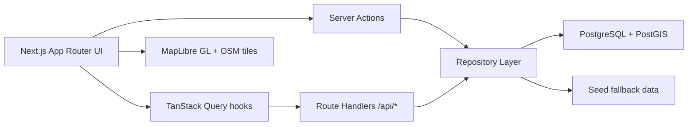

# Architecture

MapWiki is a map-first Next.js application with server-rendered dataset pages, client-rendered map exploration, route-handler APIs, and PostGIS-backed spatial queries.

## Core Modules

- `app/`: routes, pages, API handlers, auth route, providers, global styles.
- `components/`: reusable UI and map components.
- `features/`: feature-specific UI and state, including layer controls, imports, and search.
- `server/`: auth, permissions, database repositories, moderation workflows, server actions.
- `services/`: import parsing and export generation.
- `database/`: migrations and seed content.
- `tests/`: unit, integration, and Playwright tests.

## Data Flow

1. Public pages use repository functions directly for SSR.
2. Client map/search flows use `/api/*` endpoints through TanStack Query.
3. Mutations use Server Actions or authenticated route handlers.
4. Repository functions use Postgres when `DATABASE_URL` exists, otherwise seed data.
5. Every dataset and location edit is modeled as an append-only revision with a parent pointer, diff, snapshot, author, and timestamp.

## Scale Strategy

- PostGIS `GIST` indexes for viewport and spatial predicates.
- Generated `tsvector` columns for ranked search.
- Server-side filters, pagination, and BBOX query parameters.
- Separate point, line, and polygon GeoJSON sources in MapLibre.
- Point clustering and optional heatmap rendering.
- Future vector-tile path: materialize dataset tiles by zoom bucket and serve MVT through a tile route or dedicated tile service.

## Security Model

- RBAC helpers for registered users, moderators, and admins.
- NextAuth OAuth/email sessions.
- Zod validation at API boundaries.
- Parameterized SQL in repositories.
- Rate limits on high-frequency endpoints.
- Same-origin protection for unsafe API requests.
- Audit, reports, notifications, and moderation tables in the schema.

